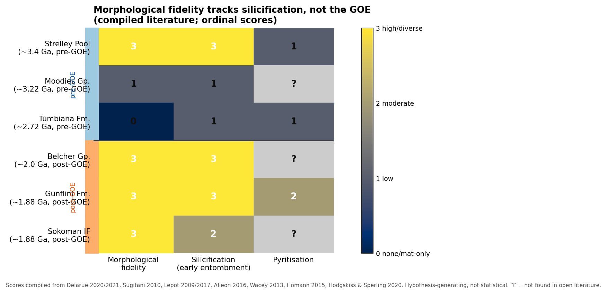

# Preliminary synthesis — preservation vs redox across the GOE

**Date:** 2026-07-12. Integrates the pilot (`../pilot/`) and the expanded two-panel dataset
(`expanded_dataset.md`, `data.csv`). Ordinal scores are hypothesis-generating, not statistical.

## Headline finding 1 — morphological fidelity tracks SILICIFICATION, not the GOE

Across all six chert-hosted biotas, morphological fidelity co-varies with **early silica
encapsulation**, and is uncorrelated with GOE side:

| | silica-encapsulated | not silica-encapsulated |
|---|---|---|
| **Pre-GOE** | Strelley Pool (**rich**) | Tumbiana, Moodies (poor) |
| **Post-GOE** | Gunflint, Sokoman, Belcher (**rich**) | (none poor in panel) |

The cleanest counter-example to a GOE/redox driver is **Strelley Pool** (~3.4 Ga, ~1 Gyr before the
GOE): silica-encapsulated, Raman ~300 °C, and morphology-rich (lenticular, chains/clusters, tail-like
forms; Delarue 2020/2021; Sugitani 2010). If redox/GOE controlled morphological richness, Strelley
Pool should be poor — it is not. Conversely, Tumbiana (pre-GOE) and Moodies (pre-GOE) are
morphology-poor precisely where silica entombment is weak or absent (carbonate globules; siliciclastic
mats). This is direct, multi-unit evidence that the original framework's GOE/redox framing of the
morphology signal is **wrong as a primary explanation** — consistent with, and stronger than, the
pilot's n=2 mechanism-revision finding.

Where the preservation mechanism is resolved at the nanoscale (Gunflint, Lepot 2017; Alleon 2016),
the preservative pathway is explicitly **early silicification + Fe-biomineralization**, while
**pyritisation is destructive** ("nearly obliterates organic structures").

## Headline finding 2 — the "redox shifted cleanly across the GOE" premise is itself contested

The bulk-shale Fe-speciation record (Panel B) does **not** show a clean, uncontested redox shift
across the GOE: ferruginous conditions dominate on both sides, euxinia is spatially variable (e.g.
Barney Creek photic euxinia, Sperling 2014; Mt McRae whiffs, Anbar 2007), and a diagenesis-aware
reassessment finds **no statistically significant FeHR/FeT or Fe_py/FeHR trend across the
Archean–Proterozoic transition** (GCA reassessment, Archimer 95949). Therefore the study cannot
*assume* a redox regime shift as the independent variable — it must treat the redox shift as itself
a hypothesis to be tested, and engage the diagenesis-overprint debate (which also bears on the
chert-panel maturity matching, reviewer concern about metamorphic resetting of proxies).

## What this changes about the causal claim

The original manuscript's mechanism — *GOE sulfate rise → pyritisation enabled → morphology
preserved* — is rejected by the expanded dataset on three independent grounds: (i) pyritisation
operated pre-GOE (Tumbiana micropyrites; BSR sulfurization); (ii) Gunflint's exceptional
preservation is silicification + Fe-biomineralization, with pyritisation destructive and locally
sulfate-limited; (iii) morphology-rich pre-GOE Strelley Pool shows the GOE is not the control.

A defensible **revised mechanism**: morphological fidelity is gated primarily by **early silica
encapsulation** (a facies/diagenetic variable, partly decoupled from marine redox), with
Fe-mineralization and the OM-decay vs OM-sulfurization balance as secondary modifiers. The GOE's
taphonomic relevance, if any, is indirect — e.g. via the silica cycle (seawater silica evolution
across the GOE and later biological silica sinks) and the OM-sulfurization trade-off, not via a
sulfate→pyritisation switch.

## Rigor / statistics note (reviewer #3)

- Ordinal scores here (0–3) are compiled qualitatively; with n = 6 biotas and several "?" cells,
  no inferential statistic is justified yet. The honest role of this synthesis is
  **hypothesis-revision**, not testing.
- The design implication is decisive: the comparison must move from a **two-group (pre/post-GOE)
  contrast** to a **within- and across-formation regression of morphological fidelity on
  silicification/mineralization indices** (continuous, many samples per formation), which both
  sidesteps the "n = 2 clusters" identifiability problem and tests the revised mechanism directly.
- The diagenesis-reassessment finding mandates that any Fe-speciation use come with explicit
  diagenetic screening (also links to reviewer concern on metamorphic overprint of proxies).

## Revised study design (concrete)

1. **Primary test (chert panel):** per-sample scoring of morphological fidelity against a
   quantitative silicification index (e.g. silica/cell-encapsulation timing from petrography/FIB)
   and Fe-mineralization type, across ≥6 formations (the panel here) + new samples. Prediction:
   fidelity ∼ silicification index within and across formations; GOE side not significant once
   silicification is controlled.
2. **Secondary test (shale panel):** compile/re-measure bulk FeHR/FeT, Fe_py/FeHR, δ³⁴S, CAS
   across the GOE *with diagenetic screening*, to test whether any redox shift exists to explain —
   engaging the diagenesis-overprint debate rather than assuming a shift.
3. **Integrate (the genuinely novel part, per reviewer #1):** link the silica-cycle evolution
   across the GOE (seawater Si, pre-diatom silicification capacity) to the preservation signal —
   this is the specific, testable, GOE-adjacent mechanism that survives the pilot, and it is *not*
   the already-established taxon-specific redox-decoupling result.
4. **Unmasking vs evolution (reviewer #4):** Tumbiana's OM-globule richness without diagnostic
   morphology, plus molecular clocks placing cyanobacteria/eukaryote origins pre-GOE, motivate
   biomarker/clock discriminators as first-tier.

## Honesty caveats
- This is a literature compilation (n = 6 chert biotas, ~5 shale units/compilations); no new
  measurements. Gaps ("?") are reported, not filled.
- "Silicification as control" is a hypothesis generated by the panel, supported by the resolved
  nanoscale cases (Gunflint), and now to be tested quantitatively — not a conclusion.
- The diagenesis-reassessment (no A–P Fe-spec trend) is one paper against a larger compilation
  literature; reported as a contested point, not adopted as settled.

## Source links
[Delarue 2020 (HAL)](https://hal.science/hal-03021289) ·
[Lepot 2017 (Nat. Commun.)](https://doi.org/10.1038/ncomms14890) ·
[Alleon 2016 (Nat. Commun.)](https://doi.org/10.1038/ncomms11977) ·
[Wacey 2013 (PNAS)](https://doi.org/10.1073/pnas.1221965110) ·
[Sperling 2014 (Geobiology)](https://historical-geobiology.stanford.edu/sites/g/files/sbiybj25131/files/media/file/sperling_et_al_geobiology_2014_final.pdf) ·
[Fe-speciation diagenesis reassessment (GCA / Archimer)](https://archimer.ifremer.fr/doc/00792/90414/95949.pdf)
